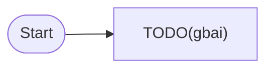

# App Flow

Owner: gbai-frontend.

## Screens

| screen | entry points | primary action | empty and error states |
|---|---|---|---|
| TODO(gbai) | | | |

## Flow

```mermaid
flowchart LR
  start([Start]) --> next["TODO(gbai)"]
```
